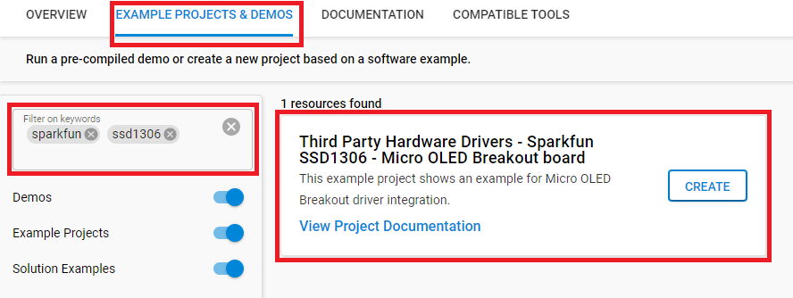

# SparkFun Micro OLED Breakout (Qwiic) Driver #

## Summary ##

This project shows the implementation of the OLED driver using a **SparkFun Micro OLED Breakout (Qwiic) board** with **BGM220 Explorer Kit** based on I2C communication.

The SparkFun Micro OLED Breakout (Qwiic) board carries a monochrome, 64 x 48px and blue-on-black OLED display. It uses a SSD1306 controller to drive the display. Its built-in functionalities include contrast control, normal or inverse image display, vertical and horizontal scrolling functions and more.

For more information about the SSD1306 controller, see the [specification page](https://cdn.sparkfun.com/assets/learn_tutorials/3/0/8/SSD1306.pdf).

>Please note that this is a monochrome OLED driver.

## Required Hardware ##

- [A BGM220 Explorer Kit board.](https://www.silabs.com/development-tools/wireless/bluetooth/bgm220-explorer-kit)

- [A SparkFun Micro OLED Breakout (Qwiic) board.](https://www.sparkfun.com/products/14532)

## Hardware Connection ##

You simply connect a *SparkFun Micro OLED Breakout (Qwiic) board* to a *BGM220 Explorer Kit* board using a Qwiic cable.

**Note:** There are several jumpers on *SparkFun Micro OLED Breakout (Qwiic) board* that can be changed to facilitate several different functions. The first of which is the ADDR jumper. The ADDR jumper can be used to change the I2C address of the board. The default jumper is open by default, pulling the address pin high and giving us an I2C address of 0X3D. Closing this jumper will ground the address pin, giving us an I2C address of 0X3C.

The second of which is the I2C pull-up jumper. If multiple boards are connected to the I2C bus, the equivalent resistance goes down, increasing your pull up strength. If multiple boards are connected on the same bus, make sure only one board has the pull-up resistors connected.

## Setup ##

To test this application, you should connect the BMG220 Explorer Kit Board to the PC using a microUSB cable.

### Create a project based on a example project ###

1. From the Launcher Home, add the BRD4314A to MyProducts, click on it, and click on the **EXAMPLE PROJECTS & DEMOS** tab. Find the example project with filter "sparkfun", "ssd1306".

2. Click **Create** button on the **Third Party Hardware Drivers - Sparkfun SSD1306 - Micro OLED Breakout board** example. Example project creation dialog pops up -> click Create and Finish and Project should be generated.

3. Build and flash this example to the board.

### Start with an empty example project ###

1. Create a "Platform - Empty C Example" project for the "BGM220 Explorer Kit Board" using Simplicity Studio 5. Use the default project settings. Be sure to connect and select the BGM220 Explorer Kit Board from the "Debug Adapters" on the left before creating a project.

2. Copy the file [app.c](https://github.com/SiliconLabs/platform_hardware_drivers_sdk_extensions/tree/master/app/example/sparkfun_micro_oled_ssd1306) (overwriting existing file), into the project root folder.

3. Install the software components:
    - Open the .slcp file in the project.
    - Select the SOFTWARE COMPONENTS tab.
    - Install the following components:
        - [Platform] → [Driver]→ [Button] → [Simple Button] → default instance name: **btn0**.
        - [Third Party Hardware Drivers] → [Display & LED] → [SSD1306 - Micro OLED Breakout (Sparkfun) - I2C]
        - [Third Party Hardware Drivers] → [Services] → [GLIB - OLED Graphics Library]

4. Build and flash the project to your device.

**Note:**

- Make sure the SDK extension already be installed. If not please follow [this documentation](https://github.com/SiliconLabs/platform_hardware_drivers_sdk_extensions/blob/master/README.md).

- SDK Extension must be enabled for the project to install "SSD1306 - Micro OLED Breakout (Sparkfun) - I2C" component. Selecting this component will also include the "I2CSPM" components with default configurated instances: qwiic.

- The example project are built on the BRD4314A board. For another boards, selecting the "SSD1306 - Micro OLED Breakout (Sparkfun) - I2C" component will include the "I2CSPM" component with unconfigured instance: inst0. These instances should be configurated by users.

## How It Works ##

After initialization, the OLED displays the text with the font 6x8. If Button 0 is pressed the OLED will display an image with some graphic effects.

The OLED display will look something like the GIF below.

## Report Bugs & Get Support ##

To report bugs in the Application Examples projects, please create a new "Issue" in the "Issues" section of [platform_hardware_drivers_sdk_extensions](https://github.com/SiliconLabs/platform_hardware_drivers_sdk_extensions) repo. Please reference the board, project, and source files associated with the bug, and reference line numbers. If you are proposing a fix, also include information on the proposed fix. Since these examples are provided as-is, there is no guarantee that these examples will be updated to fix these issues.

Questions and comments related to these examples should be made by creating a new "Issue" in the "Issues" section of [platform_hardware_drivers_sdk_extensions](https://github.com/SiliconLabs/platform_hardware_drivers_sdk_extensions) repo.
