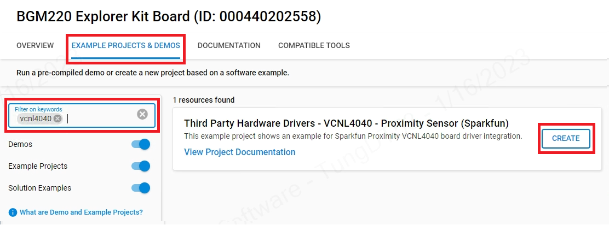

# VCNL4040 Proximity Sensor Driver #

## Summary ##

This project aims to implement a hardware driver interacting with the [VCNL4040 proximity sensor](https://www.vishay.com/ppg?84274) via APIs of GSDK.

VCNL4040 integrates a proximity sensor (PS), ambient light sensor (ALS), and a high power IRED into one small package. It incorporates photodiodes, amplifiers, and analog to digital converting circuits into a single chip by CMOS process. The 16-bit high resolution ALS offers excellent sensing capabilities with sufficient selections to fulfill most applications whether dark or high transparency lens design. High and low interrupt thresholds can be programmed for both ALS and PS, allowing the component to use a minimal amount of the microcontrollers resources. With the ability to detect objects up to 20 cm, it is often used in automatic towel and soap dispensers or automatic faucets.

The patented Filtron technology achieves ambient light spectral sensitivity closest to real human eye response and offers the best background light cancellation capability (including sunlight) without utilizing the microcontrollers’ resources. This sensor is excellent if you need a digital light sensor for your next glitter cannon.

## Required Hardware ##

- [BGM220 Explorer Kit board](https://www.silabs.com/development-tools/wireless/bluetooth/bgm220-explorer-kit)
- [SparkFun Proximity Sensor Breakout - 20cm, VCNL4040 (Qwiic)](https://www.sparkfun.com/products/15177)

## Hardware Connection ##

A VCNL4040 sensor board can be easily connected up with two I2C wires (SDA and SCL) along with 3v3 and GND. For the designated boards, SparkFun Qwiic compatible STEMMA QT connectors can be used.

## Setup ##

You can either create a project based on a example project or start with an empty example project.

### Create a project based on a example project ###

1. From the Launcher Home, add the BRD4314A to MyProducts, click on it, and click on the **EXAMPLE PROJECTS & DEMOS** tab. Find the example project with filter "VCNL4040".

2. Click **Create** button on the **Third Party Hardware Drivers - VCNL4040 - Proximity Sensor (Sparkfun)** example. Example project creation dialog pops up -> click Create and Finish and Project should be generated.

3. Build and flash this example to the board.

### Start with an empty example project ###

1. Create an "Empty C Project" for the "BGM220 Explorer Kit Board" using Simplicity Studio v5. Use the default project settings.

2. Copy the file [app.c](https://github.com/SiliconLabs/third_party_hw_drivers_extension/tree/master/app/example/sparkfun_proximity_vcnl4040/app.c) (overwriting existing file), into the project root folder.

3. Install the software components:

   - Open the .slcp file in the project.

   - Select the SOFTWARE COMPONENTS tab.

   - Install the following components
      - [Services] →  [Simple Timer]
      - [Services] →  [IO Stream] → [IO Stream: USART] → instance name: **vcom**
      - [Application] →  [Utility] → [Log]
      - [Third Party Hardware Drivers] -> [Sensors] -> [VCNL4040 - Proximity Sensor (Sparkfun)] → use default configuaration

   

4. Build and flash the project to your device

**Note:**

- Make sure the SDK extension already be installed. If not please follow [this documentation](https://github.com/SiliconLabs/third_party_hw_drivers_extension/blob/master/README.md).

- SDK Extension must be enabled for the project to install "VCNL4040 - Proximity Sensor (Sparkfun)" component. Selecting this component will also include the "I2CSPM" component with default configurated instance: qwiic.

- The example project are built on the BRD4314A board. For another boards, installing the "VCNL4040 - Proximity Sensor (Sparkfun)" component will the "I2CSPM" component with unconfigured instance: inst0. This instance should be configurated by users.

## How It Works ##

### API Overview ###

The driver divided into two layers: platform and interface layer. The platform layer perform the interaction between the sensor and the microcontroller by I2C protocol (I2CSPM platform service). The interface layer provides user public APIs to communicate with or control the operation of the sensor.

[sparkfun_vcnl4040_platform.c](https://github.com/SiliconLabs/third_party_hw_drivers_extension/tree/master/driver/public/silabs/proximity_vcnl4040/src/sparkfun_vcnl4040_platform.c) : Implementation for communication between the microcontroller and sensor board through the Silabs I2CSPM platform service.

[sparkfun_vcnl4040.c](https://github.com/SiliconLabs/third_party_hw_drivers_extension/tree/master/driver/public/silabs/proximity_vcnl4040/src/sparkfun_vcnl4040.c) : Implements public APIs to interface with VCNL4040 - Sparkfun Proximity Sensor.

[sparkfun_vcnl4040_config.h](https://github.com/SiliconLabs/third_party_hw_drivers_extension/tree/master/driver/public/silabs/proximity_vcnl4040/config/sparkfun_vcnl4040_config.h) : Defines the configuration for interrupt operation mode.

### Testing ###

The below chart represents the workflow of a simple testing program. The left chart shows the initialization steps that needed before reading data and the right chart shows the periodic measuring process.

Use Putty or other program to read the serial output.
The BGM220P uses by default a baudrate of 115200. You should expect a similar output to the one below.

## Report Bugs & Get Support ##

To report bugs in the Application Examples projects, please create a new "Issue" in the "Issues" section of [third_party_hw_drivers_extension](https://github.com/SiliconLabs/third_party_hw_drivers_extension) repo. Please reference the board, project, and source files associated with the bug, and reference line numbers. If you are proposing a fix, also include information on the proposed fix. Since these examples are provided as-is, there is no guarantee that these examples will be updated to fix these issues.

Questions and comments related to these examples should be made by creating a new "Issue" in the "Issues" section of [third_party_hw_drivers_extension](https://github.com/SiliconLabs/third_party_hw_drivers_extension) repo.
