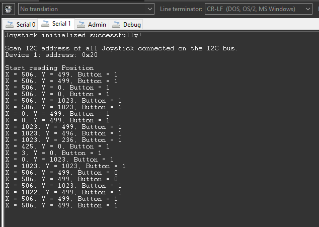

# SparkFun Qwiic Joystick Driver #

## Summary ##

This project shows the implementation of a Joystick module that is integrated on the SparkFun Qwiic Joystick board.

The SparkFun Qwiic Joystick board combines the convenience of the Qwiic connection system and an analog Joystick that is similar to the analog Joysticks on PS2 (PlayStation 2) controllers. Directional movements are simply measured with two 10 kΩ potentiometers, connected with a gimbal mechanism that separates the horizontal and vertical movements. This Joystick also has a select button that is actuated when the Joystick is pressed down. With the pre-installed firmware, the ATtiny85 acts as an intermediary (microcontroller) for the analog and digital inputs from the Joystick. This allows the Qwiic Joystick to report its position over I2C.

For more information about the SparkFun Qwiic Joystick, see the [specification page](https://learn.sparkfun.com/tutorials/qwiic-joystick-hookup-guide).

## Required Hardware ##

- [A BGM220P Explorer Kit board.](https://www.silabs.com/development-tools/wireless/bluetooth/bgm220-explorer-kit)

- [A SparkFun Qwiic Joystick Board.](https://www.sparkfun.com/products/15168)
  
## Hardware Connection ##

The Sparkfun Qwiic Joystick board can be easily connected by using a [Qwiic cable](https://www.sparkfun.com/products/17259).

## Setup ##

You can either create a project based on an example project or start with an empty example project.

### Create a project based on an example project ###

1. From the Launcher Home, add the BRD4314A to My Products, click on it, and click on the **EXAMPLE PROJECTS & DEMOS** tab. Find the example project with filter "joystick".

2. Click **Create** button on the **Third Party Hardware Drivers - Qwiic Joystick (SparkFun)** example. Example project creation dialog pops up -> click Create and Finish and Project should be generated.

3. Build and flash this example to the board.

### Start with an empty example project ###

1. Create an "Empty C Project" for the "BGM220 Explorer Kit Board" using Simplicity Studio v5. Use the default project settings.

2. Copy the file app/example/sparkfun_qwiic_joystick/app.c (overwriting existing file), into the project root folder.

3. Install the software components:

   - Open the .slcp file in the project.

   - Select the SOFTWARE COMPONENTS tab.

   - Install the following components:

      - [Services] → [Sleep Timer]
      - [Services] → [IO Stream] → [IO Stream: USART] → default instance name: vcom
      - [Application] → [Utility] → [Log]
      - [Third Party Hardware Drivers] → [Human Machine Interface] → [Qwiic Joystick (Sparkfun)]

4. Build and flash the project to your device.

**Note:**

- Make sure the SDK extension already be installed. If not please follow [this documentation](https://github.com/SiliconLabs/third_party_hw_drivers_extension/blob/master/README.md).

- SDK Extension must be enabled for the project to install "Qwiic Joystick (Sparkfun)" component.

## How It Works ##

### API Overview ###

- *sparkfun_joystick_init()*: Initialize the Joystick module. This function should be called before the main loop.

- *sparkfun_joystick_get_firmware_version()*: Read Firmware Version from the Joystick. Helpful for tech support.

- *sparkfun_joystick_set_address()*: Set new I2C address for Joystick.

- *sparkfun_joystick_get_address()*: Get current I2C address used of Joystick.

- *sparkfun_joystick_scan_address()*: Scan I2C address of all Joystick that connected on the I2C bus.

- *sparkfun_joystick_select_device()*: Select device on the I2C bus based on its I2C address.

- *sparkfun_joystick_read_horizontal_position()*: Read Current Horizontal Position from the Joystick.

- *sparkfun_joystick_read_vertical_position()*: Read Current Vertical Position from the Joystick.

- *sparkfun_joystick_read_button_position()*: Read Current Button Position from the Joystick.

- *sparkfun_joystick_check_button()*: Reads Status of Button.

- *sparkfun_joystick_present()*: Check whether a Joystick is present on the I2C bus or not.

- *sparkfun_joystick_send_command()*: Send a command and read the result over the I2C bus.

### Testing ###

This example demonstrates some of the available features of the Joystick module. Follow the below steps to test the example:

1. On your PC open a terminal program, such as the Console that is integrated in Simplicity Studio or a third-party tool terminal like TeraTerm to receive the logs from the virtual COM port.

2. Try to move the Joystick in some direction and check the logs on the terminal.

## Report Bugs & Get Support ##

To report bugs in the Application Examples projects, please create a new "Issue" in the "Issues" section of [third_party_hw_drivers_extension](https://github.com/SiliconLabs/third_party_hw_drivers_extension) repo. Please reference the board, project, and source files associated with the bug, and reference line numbers. If you are proposing a fix, also include information on the proposed fix. Since these examples are provided as-is, there is no guarantee that these examples will be updated to fix these issues.

Questions and comments related to these examples should be made by creating a new "Issue" in the "Issues" section of [third_party_hw_drivers_extension](https://github.com/SiliconLabs/third_party_hw_drivers_extension) repo.
