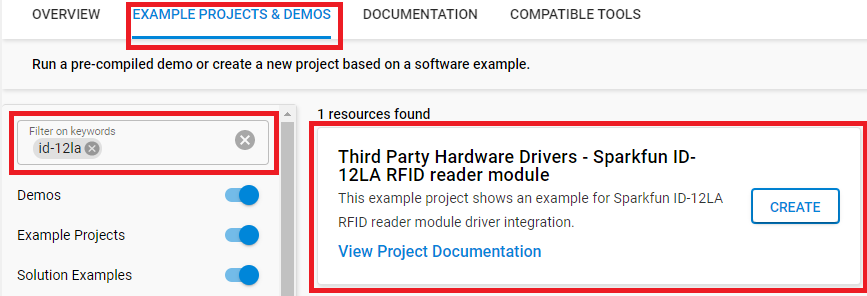

# ID-12LA RFID Reader Module #

## Summary ##

This project shows the implementation of a RFID module that outputs the 10 character unique ID ( 5 bytes ID + 1 byte checksum + 4 bytes timestamp) of a 125kHz RFID card with **BGM220 Explorer Kit** based on Qwiic communication.

## Required Hardware ##

- [A BGM220 Explorer Kit board](https://www.silabs.com/development-tools/wireless/bluetooth/bgm220-explorer-kit)

- [SparkFun RFID Qwiic Reader](https://www.sparkfun.com/products/15191)

- [RFID Reader ID-12LA](https://www.sparkfun.com/products/11827)

- [RFID Tag (125kHz)](https://www.sparkfun.com/products/14325)
  
## Hardware Connection ##

A ID12L RFID module can be easily connected up with two I2C wires (SDA and SCL) along with 3v3 and GND. For the designated boards, SparkFun Qwiic compatible STEMMA QT connectors can be used.

## Setup ##

You can either create a project based on a example project or start with an empty example project.

### Create a project based on a example project ###

1. From the Launcher Home, add the BRD4314A to MyProducts, click on it, and click on the **EXAMPLE PROJECTS & DEMOS** tab. Find the example project with filter "ID-12LA".

2. Click **Create** button on the **Third Party Hardware Drivers - Sparkfun ID-12LA RFID reader module** example. Example project creation dialog pops up -> click Create and Finish and Project should be generated.

3. Build and flash this example to the board.

### Start with an empty example project ###

1. Create an "Empty C Project" for the "BGM220 Explorer Kit Board" using Simplicity Studio v5. Use the default project settings.

2. Copy the file [app.c](https://github.com/SiliconLabs/third_party_hw_drivers_extension/tree/master/app/example/sparkfun_rfid_id12la) (overwriting existing file), into the project root folder.

3. Install the software components:

   - Open the .slcp file in the project.

   - Select the SOFTWARE COMPONENTS tab.

   - Install the following components:

      - [Services] → [Sleep Timer]
      - [Services] → [IO Stream] → [IO Stream: USART] → default instance name: vcom
      - [Application] → [Utility] → [Log]
      - [Third Party Hardware Drivers] → [Wireless Connectivity] → [ID-12LA - RFID Reader (Sparkfun) - I2C]

4. Build and flash the project to your device.

**Note:**

- Make sure the SDK extension already be installed. If not please follow [this documentation](https://github.com/SiliconLabs/third_party_hw_drivers_extension/blob/master/README.md).

- SDK Extension must be enabled for the project to install "ID-12LA - RFID Reader (Sparkfun) - I2C" component. Selecting this component will also include the "I2CSPM" component with default configurated instance: rfid.

- The example project are built on the BRD4314A board. For another boards, selecting the "ID-12LA - RFID Reader (Sparkfun) - I2C" component will include the "I2CSPM" component with unconfigured instance: inst0. This instance should be configurated by users.

## How It Works ##

### API Overview ###

A higher level kit driver I2CSPM (I2C simple poll-based master mode driver) is used for initializing the I2C peripheral as master mode and performing the I2C transfer.

[rfid_id12la.c](src/rfid_id12la.c): Communicate with the microcontroller through the Silabs I2CSPM platform service as well as implements public APIs to interface with the ID12LA RFID.

### Testing ###

This example demonstrates some of the available features of the ID12LA module. After initialization, the ID-12LA module outputs a packet through I2C ( 5 bytes ID + 1 byte checksum + 4 bytes timestamp) when it scans an RFID card. The "scan" time is not the time of day the RFID card was scanned but rather the time between when the card was scanned and when the user requested the RFID tag from the Qwiic RFID Reader (the time that data is stored in the buffer of ID12LA module). The following diagram shows the program flow as implemented in the app.c file:

Use J-Link Silicon Labs or other program to read the serial output. The BGM220P uses by default a baudrate of 115200. You should expect a similar output to the one below.

## Report Bugs & Get Support ##

To report bugs in the Application Examples projects, please create a new "Issue" in the "Issues" section of [third_party_hw_drivers_extension](https://github.com/SiliconLabs/third_party_hw_drivers_extension) repo. Please reference the board, project, and source files associated with the bug, and reference line numbers. If you are proposing a fix, also include information on the proposed fix. Since these examples are provided as-is, there is no guarantee that these examples will be updated to fix these issues.

Questions and comments related to these examples should be made by creating a new "Issue" in the "Issues" section of [third_party_hw_drivers_extension](https://github.com/SiliconLabs/third_party_hw_drivers_extension) repo.
