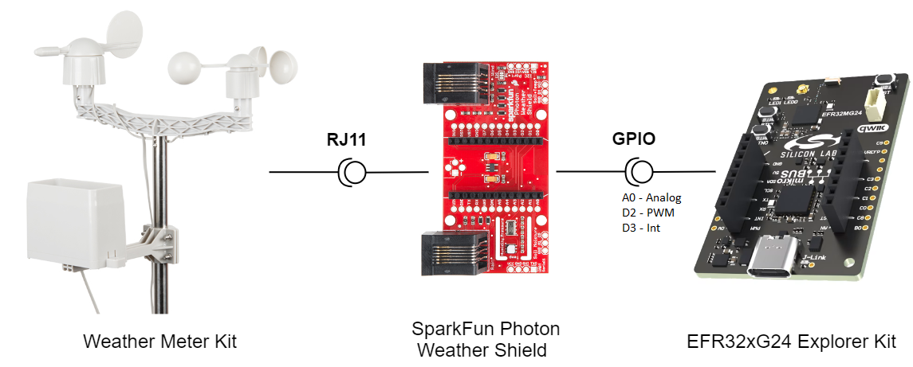
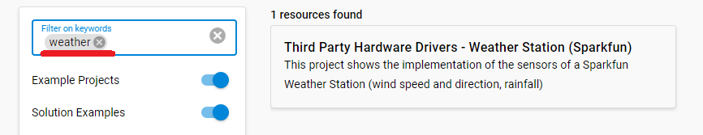
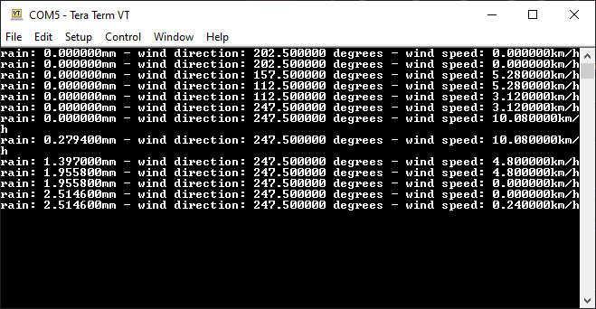

# Weather Station (Sparkfun) #

## Summary ##

This project showcases how to utilize the Sparkfun Weather Meter Kit and implement its sensors along with the Silabs Explorer Kit. Whether you are an agriculturalist, a professional meteorologist or a weather hobbyist, building your own weather station can be a really rewarding project.

The Weather Meter Kit from Sparkfun represents the three core components of weather measurement, which allow you to measure the wind speed, wind direction, and rainfall easily, over RJ-11 connections.

SparkFun Photon Weather Shield board is used to transmit data from the weather station to the Silabs Explorer Kit via the GPIO interface. Although the latter board is an add-on board, which could provide you with access to the barometric pressure, relative humidity and temperature data as well, this application example focuses only on the sensor data coming from Weather Meter Kit - the sensor data of the Photon Weather Shield board is not utilized.

For more information about the SparkFun Weather Meter Kit, see the [specification page](https://learn.sparkfun.com/tutorials/weather-meter-hookup-guide).

## Required Hardware ##

- [An EFR32xG24 Explorer Kit - xG24-EK2703A](https://www.silabs.com/development-tools/wireless/efr32xg24-explorer-kit?tab=overview#user-guides)

- [A SparkFun Weather Meter Kit](https://www.sparkfun.com/products/15901)

- [A Sparkfun Photon Weather Shield](https://www.sparkfun.com/products/retired/13674)

## Hardware Connection ##

Establish connection between the Weather Meter Kit and the Silabs EFR32xG24 Explorer Kit as described below:

1. Connect the 3V3 and GND pins of the Explorer Kit and the Photon Shield respectively.

2. Connect the RJ11 cable of the anemometer to the socket of the wind vane.

3. Connect the RJ11 cables of the wind vane and rain gauge to the corresponding RJ11 sockets of the Photon Weather Shield board.

4. Connect the analog pin of the Silabs Explorer Kit to the A0 pin of the Photon Weather Shield board.

5. Connect the PWM pin of the Silabs Explorer Kit to the D2 pin of the Photon Weather Shield board.

6. Connect the Int pin of the Silabs Explorer Kit to the D3 pin of the Photon Weather Shield board.

## Setup ##

You can either create a project based on an example project or start with an empty example project.

### Create a project based on an example project ###

1. From the Launcher Home, add the BRD2703A to My Products, click on it, and click on the **EXAMPLE PROJECTS & DEMOS** tab. Find the example project with filter "weather".

2. Click **Create** button on the **Third Party Hardware Drivers - Weather Station (SparkFun)** example. Example project creation dialog pops up -> click Create and Finish and Project should be generated.

3. Build and flash this example to the board.

### Start with an empty example project ###

1. Create an "Empty C Project" for the "EFR32xG24 Explorer Kit" using Simplicity Studio v5. Use the default project settings.

2. Copy the file `app/example/sparkfun_weatherstation/app.c` into the project root folder (overwriting the existing file).

3. Install the software components:

   - Open the .slcp file in the project.

   - Select the SOFTWARE COMPONENTS tab.

   - Select Third Party Hardware Drivers and click **Enable Extension**

   - Install the following components:

      - [Services] → [Timers] → [Sleep Timer]
      - [Services] → [IO Stream] → [IO Stream: EUSART] → default instance name: vcom
      - [Third Party] → [Tiny printf]
      - [Third Party Hardware Drivers] → [Sensors] → [Weather Meter Kit - Rainfall (Sparkfun)]
      - [Third Party Hardware Drivers] → [Sensors] → [Weather Meter Kit - Wind Direction (Sparkfun)]
      - [Third Party Hardware Drivers] → [Sensors] → [Weather Meter Kit - Wind Speed (Sparkfun)]

5. Build and flash the project to your device.

**Note:**

- Make sure that the SDK extension has already been installed.. If not, please follow [this documentation](https://github.com/SiliconLabs/third_party_hw_drivers_extension/blob/master/README.md#how-to-add-to-simplicity-studio-ide).

- SDK Extension must be enabled for the project to install "Qwiic Keypad (Sparkfun)" component.

## How It Works ##

### API Overview ###

Rainfall (rain gauge)

- *sparkfun_weatherstation_rainfall_init()*: Initializes the rainfall detection

- *sparkfun_weatherstation_rainfall_reset_rainfall_count()*: Resets the rainfall event counter

- *sparkfun_weatherstation_rainfall_get_rainfall_count()*: Gets the current value of the rainfall event counter

- *sparkfun_weatherstation_rainfall_get_rainfall_amount()*: Gets the rainfall amount in mm

Wind Direction (wind vane)

- *sparkfun_weatherstation_winddirection_init()*: Initializes the wind direction detection

- *sparkfun_weatherstation_winddirection_read_direction()*: Reads the wind direction from the sensor

Wind Speed (anemometer)

- *sparkfun_weatherstation_windspeed_init()*: Initializes the wind speed detection

- *sparkfun_weatherstation_windspeed_get()*: Reads the wind speed calculated at the last measurement

### Testing ###

This example periodically reads the measured values from the sensors. Follow the below steps to test the example:

1. On your PC, open a terminal program, such as the Console, which is integrated in Simplicity Studio or use a third-party tool terminal, like Tera Term to receive the logs from the virtual COM port.

2. Observe the measured values of the sensors.

## Report Bugs & Get Support ##

To report bugs in the Application Examples projects, please create a new "Issue" in the "Issues" section of [third_party_hw_drivers_extension](https://github.com/SiliconLabs/third_party_hw_drivers_extension) repo. Please reference the board, project, and source files associated with the bug, and reference line numbers. If you are proposing a fix, also include information on the proposed fix. Since these examples are provided as-is, there is no guarantee that these examples will be updated to fix these issues.

Questions and comments related to these examples should be made by creating a new "Issue" in the "Issues" section of [third_party_hw_drivers_extension](https://github.com/SiliconLabs/third_party_hw_drivers_extension) repo.
