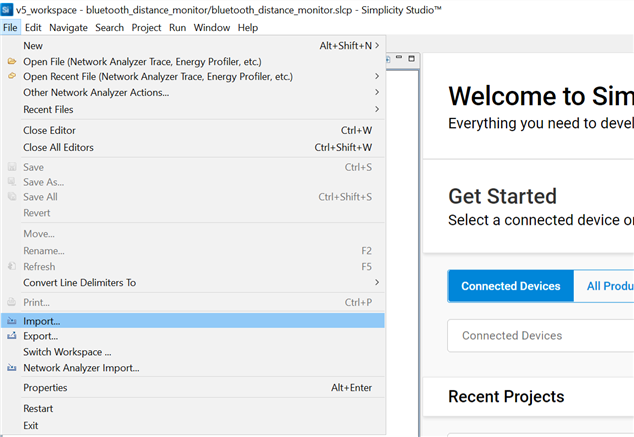
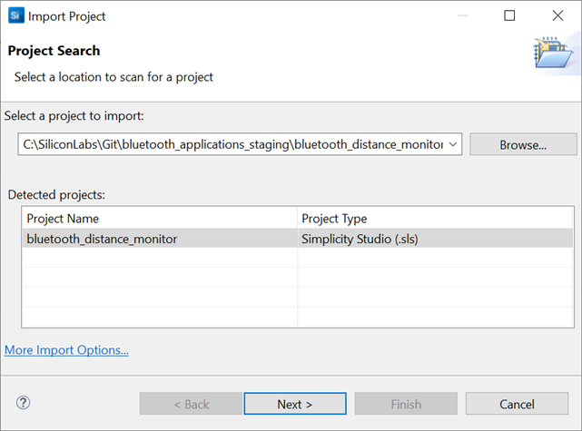
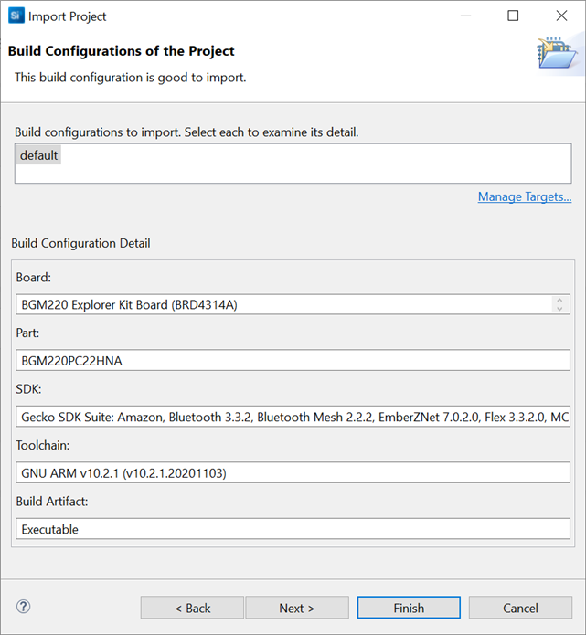
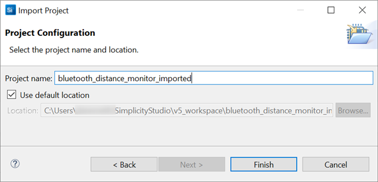

# Third Party Hardware Drivers
This section contains information on how to add the Third Party Hardware Drivers GSDK Extension, and import Application Example projects into Simplicity Studio.

## Importing Simplicity Studio projects
Simplicity Studio projects typically stored under the SimplicityStudio folder inside each project's folder in the the Git repositories.

### File Formats

* ***.sls**

  Legacy projects provide *.sls files. These Simplicity Studio files contain each source files required to build the project (except GSDK files).

* ***.slcp**
  
  Newer projects provides only *.slcp files, these files contain the project configuration, such as the configured software components, source files, headers, includes paths etc.

* ***.btconf**

    This file contains configuration interpreted by the Bluetooth GATT Configurator Tool, it contains the GATT database with the configured services and characteristics.
* ***.pintool**

    Configuration file used by the Pin Tool, these files contains hardware pin assignments and mode configurations. 

### Importing *.sls projects

* **STEP 1** **[File] -> [Import]**

  

* **STEP 2** Select a folder containing *.sls file(s). Select a project from the detected projects list and click on **Next**.

  

* **STEP 3** Click on **Next**
  
  

* **STEP 4** Type a name to the new project or keep the original naming. Click on **Finish**.

  

The selected Simplicity Studio project is imported into your workspace. You can compile the project, and run the executable on a real hardware like a development kit.

## Adding SDK Extensions for Hardware Drivers

You can find the Third Party Hardware Drivers GSDK Extension at Github, as a first step you should clone the repository to your local computer. 

You can follow this step-by-step guide to install and use the extension or watch a guideline video showing the same steps.

* **STEP 1** Clone Third Party Hardware Drivers repository from Github

  It is up to you to choose a folder on your computer to clone the repository into.

  > git clone https://github.com/SiliconLabs/platform_hardware_drivers_sdk_extensions.git

* **STEP 2** Open Simplicity Studio and go to Window/Preferences

  

* **STEP 3** Go Simplicity Studio/SDKs, select an installed GSDK (version >=4.2.0), click on **Add Extension**

  

* **STEP 4** Select the SDK Extension's location, click on **OK**

  The SDK Extension will be detected in the repository folder.

  

* **STEP 5** Click on the **Trust** button on the Verify SDK Extension dialog

  

* **STEP 6** The SDK Extension successfully installed, click on **Apply and Close**

  

### Example Project Templates

The Third Party Hardware Drivers extension provides example project templates for each supported driver.

* **STEP 1** Open the Launcher perspective in Simplicity Studio

  

* **STEP 2** Select a product either in the My Products or in the Debug Adapters dialog

* **STEP 3** Filter examples by typing "third" or "Third Party" in the "filter on keywords" input 
* **STEP 4** Select an example project from the resources and click on the **Create** button.

  

* **STEP 5** Follow the steps in the New Project Wizard dialog. 

Launcher creates a new project based on the selected template, this project contains basic example on how your application can integrate a driver using the extension.

### Software Components

* **STEP 1** Open a project configuration (The selected perspective should be "Simplicity IDE".).

* **STEP 2** Select **SOFTWARE COMPONENTS** and search with "third" keyword in the Search keywords, component's name input

  > Make sure that the components with **Evaluation** quality level are enabled in the Software Components view.

  

* **STEP 3** Select a driver from the list by clicking on it, click on the **Install**

  

The selected hardware driver is installed to your project. The installed driver's API can be found in the extension's public folder.

  

Public header files should be included in your application for each installed driver.

For further information on how to use drivers in your project see [application example templates](#example-project-templates) in the Launcher.
